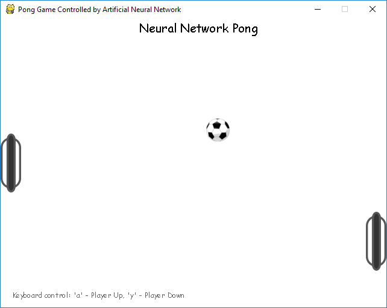
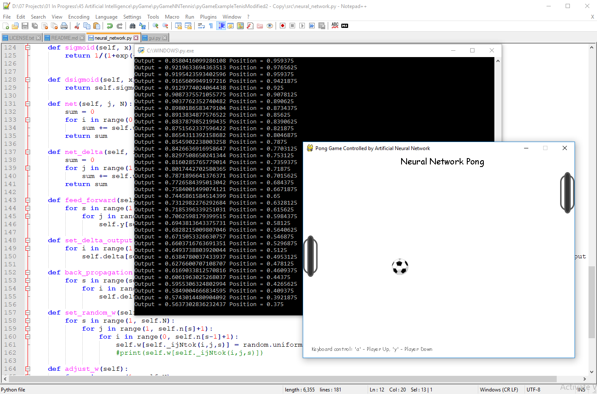

# pyTableTennisNeuralNetwork
### Demonstration of Multi-Layer Neural Network for playing Pong game 

## Introduction
This software demostrates playing Pong game against player that is artificial agent using multi-layer neural network.
At the begining player does not know anything about the game. During the game agent learns how to play by minimising target error.

It is used network that has 3 input neurons, 150 neurons in hidden layer, and 1 neuron as output.
Network implements backpropagation algorithm using mean squared error loss function and sigmoid transfer function.

It was designed from scratch and uses [Multi-Layer Neural Network](https://en.wikipedia.org/wiki/Multilayer_perceptron).

Be patient during the game because learning is not fast, and do not expect any spectacular results because this is only for indicative purpose.

Network output and possition can be monitored in cmd window.

## Run

Start gui.py file from src folder. Make sure that Requirements section are satisfied.
From windows console:  
C:\path_to_main> python gui.py

Pong Game Screenshot
[comment]: 

Output and Possition in CMD
[comment]: 

## Requirements

1. Python 3.6.4
2. Pygame 1.9.3

## References
[1] ['Multilayer perceptron'](https://en.wikipedia.org/wiki/Multilayer_perceptron) , Wikipedia

